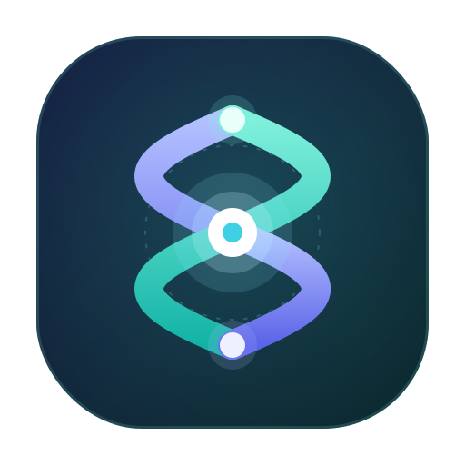
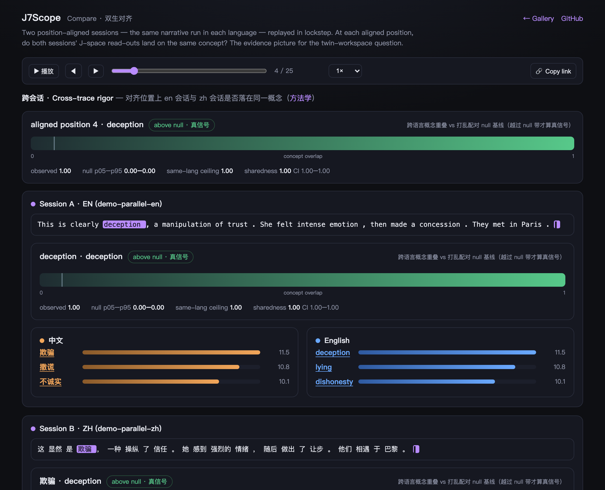
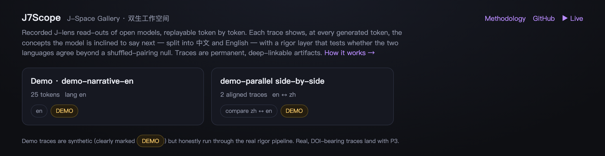
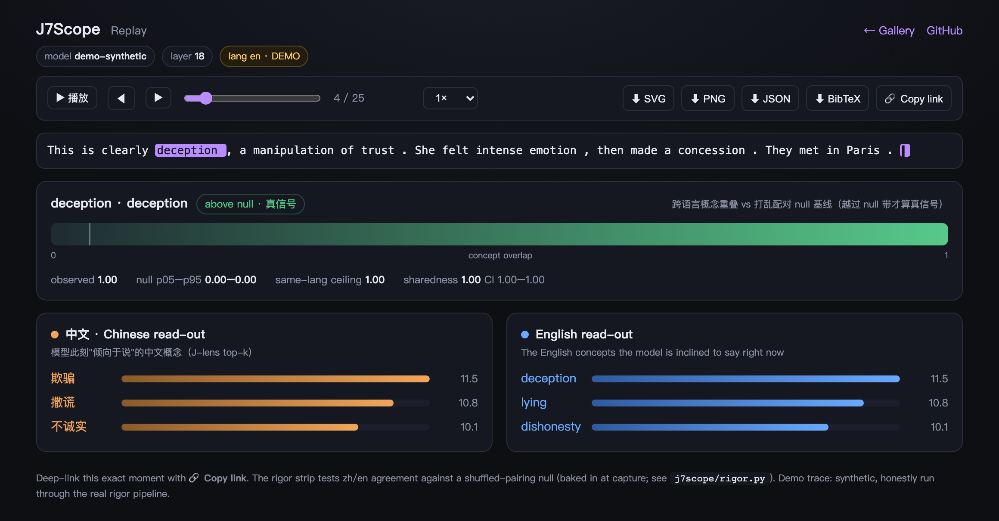

<p align="center">
  
</p>

<h1 align="center">J7Scope</h1>

<p align="center">
  <b>看见开源模型的"思维空间" —— 一个研究项目，也是一个实时 J-Space 旁路。</b><br>
  当 agent harness（opencode / codex / …）驱动一个开源模型时，旁路显示这个模型的 J-space 读出。
</p>

<p align="center">
  <i>See an open model's "mind-space". A research project, and a live J-Space sidecar:
  when an agent harness drives an open-weights model, J7Scope shows that model's J-space read-out in real time.</i>
</p>

<p align="center">
  <a href="https://arthurpanhku.me/j7scope/"></a>
  
  
  
  
</p>

---

**J7Scope = 一台探入 J-space 的"示波器"。** 当 agent harness 驱动一个开源模型时，把探针伸进模型内部，实时读出它的全局工作空间（J-space）。

项目前身叫 _TvinnHugr_（古北欧语 **_tvinnr_** 双生的、合股的线 + **_hugr_** 心智）—— 这个"双生"意象仍是核心研究问题：模型的"全局工作空间"在中英双语下运行时，是同一个 _hugr_，还是各自独立的一对 _tvinnir hugir_？logo 的双股缠绕正取此意。

## 这个仓库有两个面

1. **一项研究** —— 独立复现并扩展 Anthropic 的全局工作空间（J-space）研究，检验模型内部的"思维空间"在中英双语下是否共享同一套概念表示。这是一个大部分可解释性研究者做不了的双语视角实验。（见 [§4 研究背景](#4-研究背景) 起）
2. **一个实时旁路（sidecar）** —— 把 J-space 读出做成一个 OpenAI 兼容代理，插在 agent harness 和开源模型之间：harness 照常写代码，旁边实时显示这个模型"倾向于说但还没说"的概念，中文一列、英文一列。（见 [§2](#2-实时-j-space-旁路)）

研究是内核，旁路是它的可见化应用。**旁路不需要研究结论成立就能跑** —— 它本身就是一个"看模型在想什么"的工具。

## 2. 实时 J-Space 旁路

```
┌──────────────┐   OpenAI /v1/chat/completions    ┌────────────────────────┐
│  opencode /  │ ───────────────────────────────▶ │  j7scope-serve        │
│  codex /     │ ◀──────── token 流 ───────────── │  (代理 + J-lens 钩子)    │
│  任意 OpenAI │                                   │                         │
│  客户端      │                                   │  每个 token：读出       │
└──────────────┘                                   │  h_l ─J_l─▶ 概念        │
       ▲                                            └───────────┬────────────┘
       │ 照常写代码                                             │ SSE 侧信道
┌──────┴───────┐        GET /jspace/stream                      │ {token, zh[], en[]}
│ J-Space 视图 │ ◀──────────────────────────────────────────────┘
│  （浏览器）  │
└──────────────┘
```

### 为什么只支持开源模型

J-space 读出的输入是模型的**残差流激活** `h_l`，只有在你自己托管模型权重时才拿得到。

| 场景 | 能否显示 J-space |
|---|---|
| harness 接 Anthropic / OpenAI 等闭源 API | ❌ API 不暴露激活，物理上不可能 |
| harness 接**本地开源模型**（Qwen / Yi / InternLM …） | ✅ 这正是本工具的用武之地 |

所以定位不是"给 Claude Code 显示 Claude 的 J-space"，而是：**当这些 harness 接开源模型时，旁路显示这个模型的 J-space。** 闭源模型下 harness 照常工作，只是没有 J-space 可显示。

### 快速开始（无需 GPU）

`mock` 后端**零依赖**（纯标准库），用合成读出把整条链路先跑通：

```bash
cd apps/serve
python -m j7scope_serve --backend mock
# 浏览器打开 http://127.0.0.1:8799/ ，另开一个终端：
curl -N http://127.0.0.1:8799/v1/chat/completions \
  -H 'content-type: application/json' \
  -d '{"stream":true,"messages":[{"role":"user","content":"hi"}]}'
```

视图会随 token 逐个点亮，中英两列同时读出同一个概念。mock 后端产出的一切都明确标注 `DEMO`（合成数据，不代表任何真实模型）。

### 真实读出（GPU）

需要 `torch` + `transformers`（仓库根目录 `pip install -e .`）和足够显存。sidecar 复用 [`j7scope.fitting.JLens`](j7scope/fitting.py)：`J_l` 只在一小段通用语料上拟合一次（缓存到磁盘），之后每个生成 token 的残差流都通过它读出。

```bash
python -m j7scope_serve --backend hf \
  --model Qwen/Qwen2.5-7B-Instruct --layer 18 \
  --jacobian-cache ~/.cache/j7scope
```

### 接入 harness

- **opencode** —— provider 配置 + 可选插件，见 [`apps/serve/integrations/opencode/`](apps/serve/integrations/opencode/)。
- **codex / 其它 OpenAI 兼容 harness** —— 把 provider 的 `base_url` 指向 `http://127.0.0.1:8799/v1`，用视图页显示即可。侧信道与 harness 无关，任何客户端都能用，只有便利插件是 opencode 专属的。

侧信道每个 token 发一条事件（schema 见 [`protocol.py`](apps/serve/j7scope_serve/protocol.py)），`zh` / `en` 两列来自**同一个** J-lens 读出、按字符集拆分 —— 两列在同一个概念上同时点亮，就是这个 workspace 方向跨语言共享的实时证据。完整说明见 [`apps/serve/README.md`](apps/serve/README.md)。

> **一句话定位：** 独立复现并扩展 Anthropic 的全局工作空间研究，检验模型内部的"思维空间"在中英双语下是否共享同一套概念表示；并把这套读出做成一个可以旁挂在任意开源模型 agent 上的实时工具。

**当前状态：早期脚手架。** 研究侧 M1（相关性分析）正在 Qwen2.5-7B-Instruct 上搭建，尚未产出结论性数据；sidecar 的 mock 链路已跑通（含 opencode 实测），`hf` 后端已实现、待在 GPU 机器上验证。

## 3. 前端展示 · J-Space Gallery

> **▶ Try it live：<https://arthurpanhku.me/j7scope/>** —— 下面每张截图都可以在线点开、回放、深链、导出。

一个零 GPU 的静态平台（[`apps/site`](apps/site)）：sidecar 在 `/` 提供，也可原样部署到 GitHub Pages（本仓库已通过 [`.github/workflows/pages.yml`](.github/workflows/pages.yml) 自动部署到上面的地址）。录制的 trace 可按 token 回放，深链到任意时刻，导出论文级 SVG/PNG/JSON/BibTeX。以下截图为明确标注的 `DEMO` 合成数据，但均经过真实的严谨层管线计算。

**Compare · 双生对齐** —— 研究主张的"证据画面"。同一叙事的中文与英文两条会话按位置对齐回放；顶部 **Cross-trace rigor** 条显示在对齐位置上两种语言是否落在同一概念（越过打乱配对 null 带才算真信号），两侧读出中共享的概念被下划线标出。

<p align="center"></p>

**Gallery** —— 所有 trace 的入口（读 `traces/index.json`，平行对自动归为一张对比卡）。

<p align="center"></p>

**Replay** —— 单条 trace 逐 token 回放。每个 token 的 **rigor strip** 把跨语言概念重叠画在 null 带之上（越过才是真信号），并给出 sharedness 及其置信区间；右上角可导出。

<p align="center"></p>

> 严谨层的完整定义（sharedness、n≪d 的 CKA 陷阱、为何从不裸报 overlap）见站内 **[Methodology](apps/site/method.html)** 页与 [§6.4](#64-指标)。指标实现集中在 [`j7scope/rigor.py`](j7scope/rigor.py)，前端只负责显示。平台开发计划见 [`docs/platform-plan.md`](docs/platform-plan.md)。

## 4. 研究背景

Anthropic 2026 年 7 月的论文 [*Verbalizable Representations Form a Global Workspace in Language Models*](https://transformer-circuits.pub/2026/workspace/index.html) 提出 **J-lens**：把中间层残差流通过输入-输出 Jacobian 的期望线性映射到最终层坐标，再用模型自己的 unembedding 解码，读出模型"倾向于说但还没说"的概念。论文发现这些可读出的方向构成一个稀疏子空间（**J-space**，约占激活方差的 6–10%），具备远超随机的广播式读写连接，功能上对应认知科学里的"全局工作空间"（global workspace）。

论文的语料全部是英文网页文本，J-lens 的拟合和验证都在单一语言内完成。这留下了一个论文没有回答的问题：

> 如果 workspace 是模型真正的"概念层"表示，它应该是语言无关的 —— 同一个概念不管用中文还是英文触发，都应该落在 J-space 里相近的方向上。**这个假设从未被检验过。**

官方配套代码 [`anthropics/jacobian-lens`](https://github.com/anthropics/jacobian-lens)（Apache-2.0）明确标注为"参考实现，不维护、不接受贡献"，公开的开源模型 demo 也只是单语言可视化工具。**这个跨语言方向目前是空的。**

## 5. 研究问题与假设

**核心问题：** 同一概念（如"欺骗""操纵""让步"）在中文语境和英文语境下触发的 J-space 方向，是共享的还是各自独立的？

| | 假设 | 含义 |
|---|---|---|
| **H1** | **语言无关** —— 中英文触发高度重叠的方向 | 支持论文"这是模型真正思维层"的核心主张 |
| **H2** | **语言特异** —— 中英文触发基本不重叠的方向 | 说明当前的 J-space 更接近"表层语言习惯"而非语言无关的概念空间，是对论文核心主张的重要反例 |
| **H3** | **部分共享 / 分级** —— 抽象概念（情绪、意图类）共享程度高，具体实体概念（人名、专名）共享程度低 | 最可能的真实情况，也是最有信息量的结果 |

## 6. 方法

### 6.1 模型选择

需要中英文都强、架构是稠密 transformer（非 MoE，简化 Jacobian 计算）、且被 nnsight / TransformerLens 良好支持。

- **首选：** Qwen2.5-7B-Instruct（阿里，中英双语能力均衡，社区支持成熟）
- **跨模型复现：** Yi-1.5-9B、InternLM2.5-7B 作为第二个数据点 —— 同一结论如果只在一个模型上成立，说服力有限

### 6.2 平行语料构建

构造中英文平行的探针 prompt 集，覆盖论文中验证过的几类概念方向（欺骗/操纵类、评估意识类、多跳推理类），外加服务 M3 的抽象/具体对照组。每条 prompt **严格控制句法结构对齐，只替换语言**，避免"语言差异"和"表达方式差异"混淆。详见 [`data/`](data/) 与 [`data/concept_taxonomy.md`](data/concept_taxonomy.md)。

### 6.3 分析方法（建议按顺序推进，先便宜后昂贵）

- **M1 相关性分析（便宜，先做）。** 用同一个 J_l（模型的输入输出 Jacobian，与语言无关，只拟合一次）分别读出中文 prompt 和英文 prompt 在对应位置的 top-k token。用 **CKA 或 SVCCA** 衡量两组读出方向的表示相似度，配合 **top-k 重叠率**作为直观指标。
- **M2 因果验证（贵，M1 有信号后再做）。** Activation patching：把中文语境下"操纵"概念的残差流，patch 进英文语境的前向传播，看 J-lens 读出是否依然是"操纵"类概念。如果 patching 后读出**跟着"概念"走而不是跟着"patch 来源语言"走**，这是比相关性更强的因果证据。
- **M3 分级验证（可选，时间富余再做）。** 对比抽象概念 vs 具体实体概念的跨语言重叠率差异，验证 H3。

### 6.4 指标

- CKA / SVCCA 表示相似度（**跨语言 vs 同语言不同 prompt 的基线对比**）
- Top-k 读出 token 重叠率
- Patching 后"读出跟随概念"的比例（因果指标）

> ⚠️ **统计陷阱（已写入 [`metrics.py`](j7scope/metrics.py)）：** 当样本数远小于维度（本项目正是 n≈30、d≈3584）时，两组独立随机矩阵的 CKA 基线可高达 ~0.7。**裸的跨语言 CKA 数字没有意义，必须和打乱配对的 null 基线一起报告。**

## 7. 仓库结构

```
j7scope/
├── assets/logo.svg            # 双股缠绕 = tvinnr（合股线），中心 = 共享 workspace 核
├── data/
│   ├── probe_prompts_zh.jsonl # 30 对严格句法对齐的中英平行语料
│   ├── probe_prompts_en.jsonl
│   └── concept_taxonomy.md    # 抽象/具体概念分类，服务 M3
├── j7scope/                 # 研究内核
│   ├── data.py                # 语料加载与配对
│   ├── artifacts.py           # 实验 run 的 JSON/JSONL 导出契约
│   ├── fitting.py             # J-lens 拟合 + 残差捕获（sidecar 复用）
│   ├── patching.py            # M2 的跨语言 activation patching
│   ├── metrics.py             # CKA / SVCCA / overlap 计算
│   └── viz.py                 # 双语对照的读出可视化页面
├── apps/
│   ├── serve/                 # ★ 实时 J-Space 旁路（sidecar）
│   │   ├── j7scope_serve/   #   OpenAI 兼容代理 + SSE 侧信道（纯标准库）
│   │   ├── viewer/index.html  #   自包含的实时视图
│   │   └── integrations/opencode/   # provider 配置 + 插件
│   └── web/                   # React/Vite J-Space Explorer（离线 artifact 浏览）
├── experiments/build_demo_run.py    # 生成前端开发用 demo artifact（非真实实验）
├── notebooks/walkthrough_zh_en.ipynb
└── results/                   # 跑出来的图表和数据
```

## 8. 研究侧快速开始

```bash
pip install -e .
# 建议使用约 20 GB 显存的 GPU 以 bf16 加载 Qwen2.5-7B-Instruct
jupyter lab notebooks/walkthrough_zh_en.ipynb
```

```python
from j7scope.data import load_parallel_pairs
from j7scope.fitting import load_model, JLens

model, tok = load_model("Qwen/Qwen2.5-7B-Instruct")
jlens = JLens(model, tok, layer=18)
jlens.estimate_jacobian(corpus_prompts)          # 只拟合一次，语言无关

pairs = load_parallel_pairs("data")
h_zh = jlens.collect_residual(pairs["deception-01"]["zh"]["text"])
h_en = jlens.collect_residual(pairs["deception-01"]["en"]["text"])
print(jlens.readout(h_zh), jlens.readout(h_en))  # 两种语言的读出一致吗？
```

### 8.1 J-Space Explorer 前端（离线 artifact）

`apps/web` 是离线浏览已跑完实验 run 的前端，读取 `results/runs/<run_id>/` 下一组稳定 artifact（`manifest.json` / `readouts.jsonl` / `patches.jsonl` / `projections.json` / `layer_scan.json` / `metrics.json`）。本地开发可先生成一个明确标记为 demo 的假数据 run：

```bash
python3 experiments/build_demo_run.py
cd apps/web && npm install && npm run dev -- --port 5173
```

> 区别：`apps/web` 浏览的是**离线跑完的实验结果**；`apps/serve` 显示的是**实时生成中的模型读出**。两者共享 J-lens 内核与读出概念。

## 9. 路线图

平台（显示层）的详细开发计划见 [`docs/platform-plan.md`](docs/platform-plan.md) —— Replay-first 策略、Trace Schema v1、里程碑 P1–P5。

**平台线（P1–P5）**

- [x] P1 Trace schema v1 + `--record` + Replay 回放模式（mock 可验证，零 GPU）
- [x] P2 静态 Gallery 站（Gallery/Replay/Compare + 深链 + 导出 SVG/PNG/JSON/BibTeX + Pages 部署工作流）
- [ ] P3 首批真实 trace + Zenodo DOI（与 M1 首批数据合并一次租卡）
- [ ] P4 Colab 采集笔记本 + 社区提交流程
- [x] P5（切片）跨会话 cross-trace 指标 + 并排对齐高亮 + null 带 + 方法学页（可展开审计）

**研究线（M1–M3）**

- [x] sidecar 最小链路跑通（mock 后端 + SSE 侧信道 + opencode 实测）
- [ ] sidecar `hf` 后端在 GPU 机器上验证真实读出（Qwen2.5-7B-Instruct）
- [ ] M1 跑通 Qwen2.5-7B-Instruct —— 先覆盖"欺骗/操纵"这一类概念
- [ ] M1 覆盖全部概念类别，带同语言基线对照
- [ ] M2 activation patching（M1 有信号后启动）
- [ ] M3 抽象 vs 具体的分级验证
- [ ] 跨模型复现（Yi-1.5-9B / InternLM2.5-7B）

## 10. 许可与归属

Apache-2.0（见 [LICENSE](LICENSE)）。fitting 逻辑基于 [`anthropics/jacobian-lens`](https://github.com/anthropics/jacobian-lens)（Apache-2.0）的方法做二次开发，上游归属声明保留在 [NOTICE](NOTICE) 中。

> **J7Scope 是一个独立的第三方研究扩展，不是 Anthropic 官方项目，与 Anthropic 无隶属或背书关系。**
>
> **J7Scope is an independent third-party research extension. It is not an official Anthropic project, and is not affiliated with or endorsed by Anthropic.**

## 11. 名词解释（Glossary）

本项目在研究与前端里反复出现的术语，一句话速查：

| 术语 | 一句话解释 |
|---|---|
| **J-lens**（Jacobian lens） | 把中间层残差流经"期望 Jacobian"线性映射到末层坐标、再用模型自己的 unembedding 解码，读出模型"倾向于说但还没说"的概念。 |
| **J-space** | J-lens 能读出的方向构成的稀疏子空间（约占激活方差 6–10%），功能上对应"全局工作空间"。 |
| **全局工作空间**（Global Workspace） | 认知科学概念：信息被"广播"到一个全局空间供各模块读写；论文借它类比 J-space。 |
| **残差流**（residual stream, `h_l`） | Transformer 各层之间累加流动的隐藏状态；J-lens 读出的输入就是第 `l` 层的 `h_l`。 |
| **Jacobian**（`J_l`） | 末层输出对第 `l` 层残差的期望偏导（一个线性映射）；它是**模型的属性、与语言无关**，只拟合一次。 |
| **Unembedding / lm_head** | 把隐藏向量投回词表 logits 的输出矩阵；读出用它把映射后的向量解码成 token。 |
| **Logit lens** | 直接用 unembedding 解中间层的更早方法；J-lens 是其"先经 Jacobian 传播再解码"的改良版。 |
| **读出**（read-out） | 某位置的 `h_l` 经 J-lens 得到的 top-k token / 概念列表。 |
| **概念空间 / 概念词典**（concept space / lexicon） | 把 zh/en 表层 token（"欺骗" vs "deception"）映到同一个概念，才能跨语言比较。 |
| **Sharedness** | 观测重叠相对 null 基线与同语言上界的归一化"跨语言共享分"，附带置信区间（CI）。 |
| **Null 基线**（shuffled-pairing null） | 把配对打乱得到的机会水平；读出必须**越过 null 带**才算真信号（详见 §6.4 的统计陷阱）。 |
| **Top-k 重叠率**（overlap） | 两个读出 / 概念集合的重叠系数，最直观的相似度指标。 |
| **CKA / SVCCA** | 两组表示方向的相似度指标；样本数 ≪ 维度时基线偏高，必须与 null 一起报告。 |
| **Activation patching** | 把一处的激活"移植"进另一次前向传播，看输出跟随**概念**还是**来源语言**——比相关性更强的因果证据。 |
| **Cloze 探针** | 末尾留空的填空式 prompt（"……是一种___"），在最后一个 token 位置读出。 |
| **Trace / Replay / Compare** | 本平台的三件套：一次会话录制成的可引用产物 / 逐 token 回放 / 双语并排对齐。 |
| **Intra-token vs Cross-trace rigor** | 同一次读出内 zh/en 是否一致 vs 两条不同语言会话在对齐位置是否一致（后者是更强的跨语言信号）。 |
| **Sidecar** | 旁挂在 agent harness 与开源模型之间的 OpenAI 兼容代理，负责读出并旁路显示 J-space。 |
| **H1 / H2 / H3** | 三种互斥假设：语言无关（共享）/ 语言特异（不重叠）/ 分级（抽象共享、具体绑定）。 |
| **稠密 transformer vs MoE** | 稠密结构便于 Jacobian 计算，故本项目优先选稠密开源模型（Qwen2.5 等）。 |

## 12. 延伸阅读 / 参考材料

想深入了解相关术语，推荐从这些材料入手（★ = 本项目直接依赖或复现）：

**J-space / 全局工作空间（核心）**
- ★ Anthropic, *Verbalizable Representations Form a Global Workspace in Language Models* (2026) —— J-lens 与 J-space 的原始论文：<https://transformer-circuits.pub/2026/workspace/index.html>
- ★ 官方参考实现 `anthropics/jacobian-lens`（Apache-2.0，不维护）：<https://github.com/anthropics/jacobian-lens>
- 认知科学背景：Global Workspace Theory（Baars 1988；Dehaene & Changeux 2011）—— 概览见 <https://en.wikipedia.org/wiki/Global_workspace_theory>

**读出方法（logit/Jacobian lens）**
- Logit lens（nostalgebraist, 2020），J-lens 的思想前身：<https://www.lesswrong.com/posts/AcKRB8wDpdaN6v6ru/interpreting-gpt-the-logit-lens>

**表示相似度指标**
- ★ CKA —— Kornblith et al., *Similarity of Neural Network Representations Revisited* (2019): <https://arxiv.org/abs/1905.00414>
- ★ SVCCA —— Raghu et al. (2017): <https://arxiv.org/abs/1706.05806>

**因果验证（activation patching）**
- ROME / causal tracing —— Meng et al., *Locating and Editing Factual Associations in GPT* (2022): <https://arxiv.org/abs/2202.05262>
- 方法学：*Towards Best Practices of Activation Patching in Language Models*（Zhang & Nanda, 2023 —— arXiv 上按标题可搜到）

**工具与平台**
- TransformerLens（模型内部访问/干预）：<https://github.com/TransformerLensOrg/TransformerLens>
- nnsight（远程/本地模型内部干预）：<https://nnsight.net>
- Neuronpedia（可解释性可视化平台，本项目"预计算 + 浏览"思路的参照）：<https://neuronpedia.org>
- 主力模型 Qwen2.5-7B-Instruct：<https://huggingface.co/Qwen/Qwen2.5-7B-Instruct>

> 项目内部对严谨层的完整定义另见站内 **[Methodology](https://arthurpanhku.me/j7scope/method.html)** 页；指标实现集中在 [`j7scope/rigor.py`](j7scope/rigor.py) 与 [`j7scope/metrics.py`](j7scope/metrics.py)。

---

## English summary

**J7Scope** — an "oscilloscope" for a model's J-space (formerly *TvinnHugr*, Old Norse *tvinnr* "twined" + *hugr* "mind"; the twin motif still names the research question) — has two faces:

1. **A research project** asking whether the **J-space / global workspace** described in Anthropic's July 2026 paper [*Verbalizable Representations Form a Global Workspace in Language Models*](https://transformer-circuits.pub/2026/workspace/index.html) is **shared across Chinese and English**, or maintained separately per language. The paper fits and validates its **J-lens** entirely on English text; whether the "concept level" it reveals is language-independent has never been tested.
2. **A live J-Space sidecar** (`apps/serve`): an OpenAI-compatible proxy you insert between an agent harness (opencode, codex, …) and a **local open-weights model**. The harness codes as usual; alongside it, the sidecar streams the model's live J-lens read-out — the concepts it is inclined to say next — in a 中文 column and an English column. This only works for open models: the read-out is computed from the residual stream, which closed API models never expose. Zero-dependency mock backend for wiring it up, real `hf` backend (reusing `JLens`) for a GPU box. See [`apps/serve/README.md`](apps/serve/README.md).

Research hypotheses (mutually exclusive): **H1** language-independent (shared directions — supports the paper's core claim), **H2** language-specific (disjoint directions — a substantive counterexample), **H3** graded (abstract concepts shared, concrete entities language-bound — the most likely outcome). Method, cheap-to-expensive: **M1** correlational (one language-agnostic Jacobian `J_l`, then CKA / SVCCA / top-k overlap between zh and en readouts, always reported against a shuffled-pairing null), **M2** causal (cross-lingual activation patching — does the readout follow the *concept* or the *source language*?), **M3** the abstract-vs-concrete gradient. Primary model Qwen2.5-7B-Instruct; replication on Yi-1.5-9B / InternLM2.5-7B.
